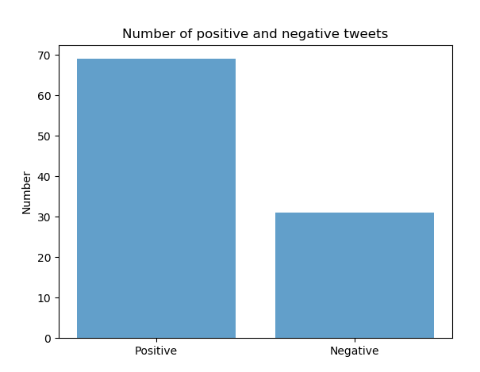

# Twitter-Sentiment-Analysis
Model for recent 100 English tweets of Twiter

Dataset - Cornell Sentiment Polarity Dataset v2.0

preprocessed the data using regular expression, and applied TF-IDF model on the dataset.
Then made a classifier by applying Logistic regression (Machine Learning approcah) to classify the dataset in positive and negative.
Then used twitter API (tweepy) to fetch the recent 100 english tweet on particular topic (India), preprocessed those tweets.And using the classifier predict
the Sentiment and plot the bars using matplotlib.pyplot .

